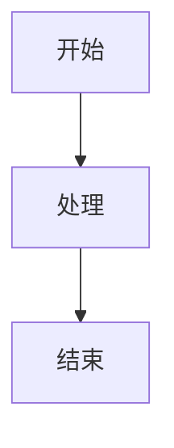

# HOS-M2F v1.0

## 多场景结构化内容编译引擎

HOS-M2F = 面向 AI 写作与专业文档生产的 **内容编译器引擎**

Markdown 是源码，不同 Mode 是"目标行业标准"

## 快速开始

### 安装

```bash
# 克隆仓库
git clone <repository-url>
cd HOS-M2F

# 安装依赖
pip install -e .
```

### 基本使用

```bash
# 构建电子书
HOS_M2F build input.md --mode book --format epub

# 构建技术文档
HOS_M2F build report.md --mode paper --format pdf

# 校验专利文档
HOS_M2F check patent.md --mode patent
```

## 核心功能

### 三层架构解析器

HOS-M2F 采用先进的三层架构解析器，确保文档结构和资源的正确处理：

| 层级      | 功能    | 核心处理           |
| --------- | ----- | -------------- |
| `Layer 1` | DOM解析  | 解析HTML/Markdown为DOM树      |
| `Layer 2` | 资源提取  | 提取图片、代码块、Mermaid图表等资源         |
| `Layer 3` | 内容重构  | 重构内容，替换资源为自定义标签     |

### 内置官方模式

| Mode      | 领域    | 核心产出           |
| --------- | ----- | -------------- |
| `paper`   | 技术文档  | 报告 / 论文排版      |
| `patent`  | 专利申请  | 合规专利文件         |
| `book` 📚 | 电子书出版 | EPUB / KDP     |
| `sop` 🛠  | 运维与实施 | 巡检 / 报错 / 实施报告 |

### 输出支持

| 格式          | 描述                |
| ----------- | ----------------- |
| EPUB        | 电子书格式，支持KDP出版     |
| DOCX        | Microsoft Word文档格式 |
| PDF         | 可打印文档格式           |
| JSON        | 结构化数据格式           |
| HTML        | 网页格式              |
| XML         | 标记语言格式            |
| LaTeX       | 学术排版格式            |
| XLSX        | Excel电子表格格式        |

### 输入支持

| 格式          | 描述                |
| ----------- | ----------------- |
| Markdown    | 主要输入格式            |
| PDF         | 支持PDF转Markdown     |
| DOCX        | 支持Word转Markdown    |
| EPUB        | 支持电子书转Markdown    |
| HTML        | 支持网页转Markdown     |
| XML         | 支持XML转Markdown     |
| XLSX        | 支持Excel转Markdown    |

## 详细使用指南

### CLI 命令

#### 构建命令

```bash
# 基本构建
hos-m2f build input.md output.epub --mode book --format epub

# 指定输出路径
hos-m2f build input.md output.pdf --mode paper --format pdf

# 使用KDP模式构建电子书
hos-m2f build book.md output.epub --mode book --format epub --options "{\"platform\": \"kdp\"}"

# 构建为博客格式
hos-m2f build article.md output.html --mode paper --format html --options "{\"format\": \"blog\"}"
```

#### 校验命令

```bash
# 校验书籍
hos-m2f check book.md --mode book

# 校验专利
hos-m2f check patent.md --mode patent

# 校验SOP文档
hos-m2f check sop.md --mode sop
```

#### 转换命令

```bash
# Markdown转DOCX
hos-m2f convert input.md output.docx --from md --to docx

# PDF转Markdown
hos-m2f convert input.pdf output.md --from pdf --to md

# Markdown转HTML博客格式
hos-m2f convert article.md output.html --from md --to html --options "{\"format\": \"blog\"}"

# Markdown转JSON
hos-m2f convert input.md output.json --from md --to json

# Markdown转XML
hos-m2f convert input.md output.xml --from md --to xml

# Markdown转Excel
hos-m2f convert input.md output.xlsx --from md --to xlsx

# Excel转Markdown
hos-m2f convert input.xlsx output.md --from xlsx --to md

# Excel转HTML
hos-m2f convert input.xlsx output.html --from xlsx --to html

# Excel转JSON
hos-m2f convert input.xlsx output.json --from xlsx --to json
```

### Python SDK

#### 基本使用

```python
from hos_m2f import Engine

# 初始化引擎
engine = Engine()

# 构建电子书
with open("input.md", "r", encoding="utf-8") as f:
    markdown_content = f.read()

result = engine.build(
    content=markdown_content,
    mode="book",
    output_format="epub",
    options={"platform": "kdp", "title": "我的电子书", "author": "作者名"}
)

# 保存输出
with open("output.epub", "wb") as f:
    f.write(result.binary)

# 构建为博客格式
result = engine.build(
    content=markdown_content,
    mode="paper",
    output_format="html",
    options={"format": "blog", "title": "我的博客文章", "author": "作者名"}
)

# 保存博客输出
with open("output_blog.html", "wb") as f:
    f.write(result.binary)
```

#### 格式转换

```python
from hos_m2f import Engine

# 初始化引擎
engine = Engine()

# 读取PDF文件
with open("input.pdf", "rb") as f:
    pdf_content = f.read()

# 转换为Markdown
md_content = engine.convert_content(
    input_format="pdf",
    output_format="md",
    input_content=pdf_content
)

# 保存结果
with open("output.md", "wb") as f:
    f.write(md_content)

# Excel转Markdown
with open("input.xlsx", "rb") as f:
    xlsx_content = f.read()

md_content = engine.convert_content(
    input_format="xlsx",
    output_format="md",
    input_content=xlsx_content
)

with open("output.md", "wb") as f:
    f.write(md_content)

# Markdown转Excel
with open("input.md", "r", encoding="utf-8") as f:
    md_content = f.read()

xlsx_content = engine.convert_content(
    input_format="md",
    output_format="xlsx",
    input_content=md_content
)

with open("output.xlsx", "wb") as f:
    f.write(xlsx_content)
```

#### 校验文档

```python
from hos_m2f import Engine

# 初始化引擎
engine = Engine()

# 读取文档
with open("patent.md", "r", encoding="utf-8") as f:
    patent_content = f.read()

# 校验文档
validation_result = engine.check(
    content=patent_content,
    mode="patent"
)

# 打印校验结果
print(f"Valid: {validation_result['valid']}")
if not validation_result['valid']:
    print("Errors:")
    for error in validation_result['errors']:
        print(f"- {error}")
    print("Warnings:")
    for warning in validation_result['warnings']:
        print(f"- {warning}")
```

## 高级功能

### LaTeX 支持

HOS-M2F 支持 LaTeX 格式输出，特别适合学术论文和技术报告：

```bash
# 构建LaTeX文档
HOS_M2F build paper.md --mode paper --format latex

# 构建并编译为PDF
HOS_M2F build paper.md --mode paper --format latex --options "{\"compile\": true}"
```

### 自定义模式

您可以通过 YAML 文件创建自定义模式：

```yaml
# user_modes/meeting_notes.yaml
name: meeting_notes
base: paper
description: 会议记录模式

rules:
  - type: required_section
    title: 会议主题
    level: 2
  - type: required_section
    title: 参会人员
    level: 2
  - type: required_section
    title: 会议内容
    level: 2
  - type: required_section
    title: 行动项
    level: 2
  - type: required_section
    title: 下次会议
    level: 2
```

使用自定义模式：

```bash
HOS_M2F build meeting.md --mode meeting_notes --format docx
```

### KDP 出版支持

HOS-M2F 提供了专门的 KDP 模式，确保您的电子书符合 Amazon KDP 的出版要求：

```bash
# 构建KDP兼容的电子书
HOS_M2F build book.md --mode book --format epub --options "{\"platform\": \"kdp\"}"

# 校验KDP兼容性
HOS_M2F check book.md --mode book --platform kdp
```

## 项目结构

```
hos_m2f/
├── engine/               # ⭐ 对外统一引擎接口
│   └── engine.py
│
├── modes/                # 内置模式
│   ├── book_mode.py
│   ├── patent_mode.py
│   ├── sop_mode.py
│   └── paper_mode.py
│
├── user_modes/           # 用户自定义模式
│   └── *.yaml
│
├── structure/            # 结构解析层
│   ├── semantic_parser.py
│   ├── book_parser.py
│   ├── patent_parser.py
│   └── sop_parser.py
│
├── renderers/            # 渲染适配层
│   ├── epub_renderer.py
│   ├── pdf_renderer.py
│   ├── docx_renderer.py
│   ├── json_renderer.py
│   ├── html_renderer.py
│   ├── xml_renderer.py
│   ├── latex_renderer.py
│   └── xlsx_renderer.py
│
├── converters/           # 格式转换层
│   ├── md_to_docx.py
│   ├── md_to_epub.py
│   ├── md_to_html.py
│   ├── md_to_json.py
│   ├── md_to_latex.py
│   ├── md_to_xml.py
│   ├── docx_to_md.py
│   ├── epub_to_md.py
│   ├── html_to_md.py
│   ├── json_to_md.py
│   ├── pdf_to_md.py
│   └── xml_to_md.py
│
├── ide/                  # IDE 集成接口
    ├── api.py
    └── preview_server.py
│
├── version/              # 版本控制模块
    ├── __init__.py
    └── version_control.py
```

## 扩展能力

### 版本控制

HOS-M2F 提供了强大的版本控制功能，帮助您管理文档的变更历史和版本追踪：

#### 核心功能
- **自动版本创建**：在文档转换过程中自动创建版本记录
- **版本历史查询**：查看文档的完整版本历史
- **版本回滚**：回滚到之前的任何版本
- **版本比较**：比较不同版本之间的差异
- **版本清理**：自动清理旧版本，节省存储空间

#### 使用方法

```python
from hos_m2f import Engine

# 初始化引擎
engine = Engine()

# 获取版本控制实例
version_control = engine.get_version_control()

# 创建文档版本
with open("document.md", "r", encoding="utf-8") as f:
    content = f.read()

version_info = version_control.create_version(
    document_path="document.md",
    content=content,
    message="初始版本",
    author="用户"
)

# 获取版本历史
history = version_control.get_version_history("document.md")

# 回滚到之前的版本
version_id = history[2]["id"]  # 获取第三个版本
version_control.revert_to_version("document.md", version_id)

# 比较版本
diff = version_control.compare_versions(
    history[0]["id"],  # 最新版本
    history[1]["id"]   # 上一个版本
)

# 清理旧版本（保留最近5个）
deleted_count = version_control.cleanup_versions(
    "document.md",
    keep_last=5
)
```

### 语义校验引擎
- 专利是否缺少摘要
- 书籍是否缺版权页
- SOP 是否缺结论
- 论文是否缺参考文献

### 风格主题系统
企业可统一视觉风格：

```yaml
theme: blue_enterprise
font: Source Han Sans
cover_style: minimal
```

### 增量构建能力
只更新修改过的章节，提高大书籍或长报告构建速度

### 结构化数据导出
SOP 报告可导出 JSON 供企业系统分析

### 资源提取与管理

HOS-M2F 支持自动提取和管理文档中的资源，包括图片、代码块和 Mermaid 图表：

#### 图片提取
自动识别并提取 Markdown 和 HTML 中的图片：

```markdown

```

#### Mermaid 图表支持
自动渲染 Mermaid 图表为图片：

```markdown

```

#### 资源存储
提取的资源会被存储在 `assets` 目录中，并在输出中使用自定义标签引用：

```html
<hos-image id="img_000"/>
<hos-mermaid id="mermaid_000"/>
```

#### 资源去重
支持图片去重，避免重复下载相同的图片资源。

### 表格支持
支持复杂表格的渲染，包括对齐和样式：

```markdown
| 左对齐 | 居中 | 右对齐 |
| :--- | :---: | ---: |
| 内容 | 内容 | 内容 |
| 内容 | 内容 | 内容 |
```

### 博客格式支持
支持将Markdown转换为美观的博客格式：

```bash
# 构建为博客格式
HOS_M2F build article.md --mode paper --format html --options "{\"format\": \"blog\"}"
```

博客格式特点：
- 响应式设计，适配不同设备
- 美观的排版和样式
- 支持特色图片
- 自动生成分享按钮
- 支持标签和元数据

### 表格增强
支持复杂表格的渲染，包括对齐和样式：

```markdown
| 左对齐 | 居中 | 右对齐 |
| :--- | :---: | ---: |
| 内容 | 内容 | 内容 |
| 内容 | 内容 | 内容 |
```

## 故障排除

### 常见问题

#### 1. LaTeX 编译失败

**问题**：LaTeX 编译失败，提示缺少依赖。

**解决方案**：安装 LaTeX 发行版，如 TeX Live 或 MiKTeX。

#### 2. PDF 渲染失败

**问题**：PDF 渲染失败，提示缺少 WeasyPrint 依赖。

**解决方案**：安装 WeasyPrint：
```bash
pip install weasyprint
```

#### 3. EPUB 生成错误

**问题**：EPUB 生成失败，提示缺少 ebooklib 依赖。

**解决方案**：安装 ebooklib：
```bash
pip install ebooklib
```

#### 4. Mermaid 图表不显示

**问题**：Mermaid 图表在输出中不显示。

**解决方案**：确保网络连接正常，Mermaid 图表需要通过网络渲染。

### 错误代码

| 错误代码 | 描述                | 解决方案              |
| ---- | ----------------- | ------------------ |
| 1001 | 模式不存在             | 检查模式名称是否正确         |
| 1002 | 输出格式不支持           | 检查格式是否在支持列表中       |
| 1003 | 输入文件不存在           | 检查文件路径是否正确         |
| 1004 | 依赖项缺失             | 安装缺失的依赖项          |
| 1005 | 文档结构无效            | 检查文档结构是否符合模式要求     |
| 1006 | KDP 兼容性错误         | 修复 KDP 兼容性问题       |
| 1007 | LaTeX 编译失败         | 检查 LaTeX 语法和依赖项    |
| 1008 | PDF 渲染失败          | 检查 WeasyPrint 安装和配置 |

## 性能优化

### 大文档处理

对于大型文档（超过 100 页），建议使用以下优化：

1. **启用增量构建**：只更新修改过的章节
2. **使用分段处理**：将大文档拆分为多个小文档
3. **选择合适的输出格式**：对于预览，使用 HTML 格式
4. **限制图片分辨率**：减少图片大小以提高处理速度

### 批量处理

对于批量处理多个文档，建议：

1. **使用 `--batch` 参数**：启用批量处理模式
2. **设置合理的并发数**：避免系统资源耗尽
3. **使用日志记录**：跟踪处理进度和错误

## 许可证
MIT License

## 贡献

欢迎贡献代码、报告问题或提出建议！

## 联系方式

- 项目主页：<repository-url>
- 问题反馈：<repository-url>/issues
- 邮件：<contact-email>

---

**HOS-M2F** - 让专业文档生产更简单！